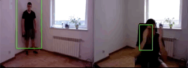

# HumanDetection

Real time human detection and counting.

The program is detecting people via webcam (speed of detecting varies depending on the speed of CPU). Main feature is **histogram of oriented gradients (HOG)** and OpenCV tools for video input and output.

## *
  - detector works better if person is not close to camera (might cause multiply overlapping boxes)
  
## How to run
  1. Run `model.py`
  2. Webcam footage will launch in seperate window
  3. When done, quit application
  4. Footage is saved in directory
